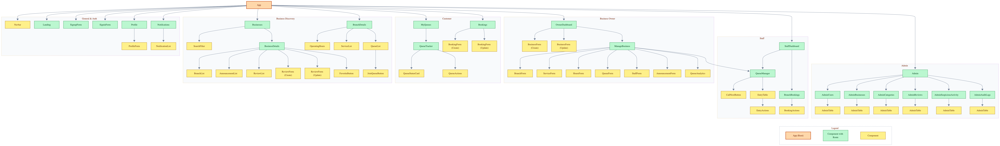

# QLess

A virtual queue management platform that allows customers to join queues remotely, track their position in real time, and receive notifications while businesses manage branches, services, staff, bookings, and queues from one platform.

## Project Overview

QLess is designed to reduce physical waiting times and make queue management easier for both customers and businesses.

Customers can discover businesses, select a branch and service, join a virtual queue, track their position, receive estimated waiting times, and get notified when their turn approaches.

Business owners can manage their businesses, branches, services, operating hours, queues, staff, bookings, announcements, and queue analytics.

Admins manage the overall platform, including users, businesses, categories, reviews, suspicious activity, and audit logs.

---

## Key Features

### Customer

* Browse approved businesses without signing in
* Search and filter businesses
* View business branches, services, hours, and queue status
* Join virtual queues remotely
* Receive a queue number
* Track people ahead and current queue position
* View estimated waiting time
* Receive a recommended return time
* Receive real-time queue notifications
* Mark that they are on the way
* Check in when called
* Leave or cancel a queue
* View queue history
* Receive no-show warnings
* Make and manage service bookings
* Review businesses after completing a service
* Favorite businesses
* Receive business announcements

### Business Management

* Create and manage businesses
* Submit businesses for admin approval
* Manage multiple branches
* Manage branch addresses and contact information
* Add and manage services
* Configure operating hours
* Create and manage virtual queues
* Open, pause, resume, and close queues
* Set queue capacity
* Configure average service duration
* Configure no-show grace periods
* Manage branch staff
* Monitor customers waiting in queues
* Track customers who are on their way
* Manage bookings
* Publish announcements
* View reviews
* View queue analytics

### Staff

* Access assigned business and branch
* View branch services and operating hours
* Manage active queues
* View waiting customers
* See customers who are on their way
* Call the next customer
* Check in customers
* Mark customers as completed
* Mark customers as no-shows
* Pause and resume queues
* View queue history
* View branch bookings

### Admin

* View platform dashboard and statistics
* Manage user accounts
* Approve or reject businesses
* Activate or deactivate businesses and branches
* Manage categories
* Monitor queues
* Manage reviews
* Monitor suspicious activity
* View administrative audit logs

---

## User Roles

| Role               | Description                                                                           |
| ------------------ | ------------------------------------------------------------------------------------- |
| **Guest**          | Browse businesses and explore QLess without an account.                           |
| **Customer**       | Discover businesses, join virtual queues, manage bookings, and receive notifications. |
| **Business Owner** | Manage businesses, branches, services, queues, staff, bookings, and announcements.    |
| **Staff**          | Manage queues and customers at an assigned branch.                                    |
| **Admin**          | Manage and monitor the QLess platform, users, businesses, and activity.           |

---

## Tech Stack

### Backend

* Python
* FastAPI
* SQLAlchemy
* PostgreSQL
* Alembic
* JWT Authentication
* Pydantic
* WebSockets

### Frontend

* React
* JavaScript
* HTML
* CSS

### Development Tools

* Git
* GitHub
* Postman
* Uvicorn
* Pytest

---
## Frontend Repository

[QLess Frontend Repository](https://github.com/fatema-maitham/QLess-Frontend)

---

## Getting Started

1. Install packages
```bash
   pipenv install
```
2. Create a `.env` file
```
   DATABASE_URL=postgresql://localhost:5432/qless
   JWT_SECRET=your_long_random_secret
   CORS_ORIGINS=http://localhost:5173
```
3. Create the tables and add test data
```bash
   pipenv run alembic upgrade head
   pipenv run python seed.py
```
4. Start the server, then open http://127.0.0.1:8000/docs
```bash
   pipenv run uvicorn main:app --reload
```
5. Run the tests
```bash
   pipenv run pytest -v
```

### Test accounts (password: `password123`)

| Role | Email |
| --- | --- |
| Admin | admin@qless.com |
| Owner | owner@qless.com |
| Staff | staff@qless.com |
| Customer | customer@qless.com |

---

## Database Design (ERD)


---
## Component Hierarchy



---

## API Routes
Base URL: `/api`

Auth: JWT bearer token. Logout is handled on the frontend by deleting the token.

---

### Auth Routes

| HTTP Method | Controller | Response | URI             | Role   | Use Case                       |
| ----------- | ---------- | -------: | --------------- | ------ | ------------------------------ |
| POST        | sign_up    |      201 | `/auth/sign-up` | Public | Create a new user account      |
| POST        | sign_in    |      200 | `/auth/sign-in` | Public | Log in and receive a JWT token |

---

### User Routes

| HTTP Method | Controller          | Response | URI                    | Role           | Use Case                                       |
| ----------- | ------------------- | -------: | ---------------------- | -------------- | ---------------------------------------------- |
| GET         | get_me              |      200 | `/users/me`            | Logged in      | Get current user profile (incl. restriction)   |
| PATCH       | update_me           |      200 | `/users/me`            | Logged in      | Update profile                                 |
| DELETE      | delete_me           |      200 | `/users/me`            | Logged in      | Delete account                                 |
| GET         | get_my_businesses   |      200 | `/users/me/businesses` | Business Owner | List own businesses (pending/approved/rejected)|

---

### Category Routes

| HTTP Method | Controller      | Response | URI                         | Role   | Use Case              |
| ----------- | --------------- | -------: | --------------------------- | ------ | --------------------- |
| GET         | get_categories  |      200 | `/categories`               | Public | List all categories   |
| POST        | create_category |      201 | `/categories`               | Admin  | Create a category     |
| PATCH       | update_category |      200 | `/categories/{category_id}` | Admin  | Update a category     |
| DELETE      | delete_category |      200 | `/categories/{category_id}` | Admin  | Delete a category     |

---

### Business Routes

| HTTP Method | Controller      | Response | URI                         | Role           | Use Case                                              |
| ----------- | --------------- | -------: | --------------------------- | -------------- | ----------------------------------------------------- |
| GET         | get_businesses  |      200 | `/businesses`               | Public         | List approved businesses (`?search=&category_id=`)    |
| POST        | create_business |      201 | `/businesses`               | Business Owner | Create a business (status starts as `draft`)          |
| GET         | show_business   |      200 | `/businesses/{business_id}` | Public         | Get a single business                                 |
| PATCH       | update_business |      200 | `/businesses/{business_id}` | Business Owner | Update info, or submit/resubmit (`approval_status: "pending"`) |
| DELETE      | delete_business |      200 | `/businesses/{business_id}` | Business Owner | Deactivate a business                                 |

---

### Branch Routes

| HTTP Method | Controller    | Response | URI                                  | Role           | Use Case                      |
| ----------- | ------------- | -------: | ------------------------------------ | -------------- | ----------------------------- |
| GET         | get_branches  |      200 | `/businesses/{business_id}/branches` | Public         | List branches of a business   |
| POST        | create_branch |      201 | `/businesses/{business_id}/branches` | Business Owner | Create a branch               |
| GET         | show_branch   |      200 | `/branches/{branch_id}`              | Public         | Get branch details + open now |
| PATCH       | update_branch |      200 | `/branches/{branch_id}`              | Business Owner | Update branch info            |
| DELETE      | delete_branch |      200 | `/branches/{branch_id}`              | Business Owner | Deactivate a branch           |

---

### Service Routes

| HTTP Method | Controller     | Response | URI                              | Role           | Use Case                      |
| ----------- | -------------- | -------: | -------------------------------- | -------------- | ----------------------------- |
| GET         | get_services   |      200 | `/branches/{branch_id}/services` | Public         | List services at a branch     |
| POST        | create_service |      201 | `/branches/{branch_id}/services` | Business Owner | Add a service to a branch     |
| GET         | show_service   |      200 | `/services/{service_id}`         | Public         | Get a single service          |
| PATCH       | update_service |      200 | `/services/{service_id}`         | Business Owner | Update a service              |
| DELETE      | delete_service |      200 | `/services/{service_id}`         | Business Owner | Deactivate a service          |

---

### Operating Hour Routes

| HTTP Method | Controller            | Response | URI                           | Role           | Use Case                    |
| ----------- | --------------------- | -------: | ----------------------------- | -------------- | --------------------------- |
| GET         | get_operating_hours   |      200 | `/branches/{branch_id}/hours` | Public         | List branch operating hours |
| POST        | create_operating_hour |      201 | `/branches/{branch_id}/hours` | Business Owner | Add an operating hour       |
| PATCH       | update_operating_hour |      200 | `/hours/{hour_id}`            | Business Owner | Update an operating hour    |
| DELETE      | delete_operating_hour |      200 | `/hours/{hour_id}`            | Business Owner | Delete an operating hour    |

---

### Queue Routes

| HTTP Method | Controller          | Response | URI                               | Role                   | Use Case                                              |
| ----------- | ------------------- | -------: | --------------------------------- | ---------------------- | ----------------------------------------------------- |
| GET         | get_queues          |      200 | `/branches/{branch_id}/queues`    | Public                 | List queues at a branch with live status              |
| POST        | create_queue        |      201 | `/branches/{branch_id}/queues`    | Business Owner         | Create a queue                                        |
| GET         | show_queue          |      200 | `/queues/{queue_id}`              | Public                 | Get queue details and status                          |
| PATCH       | update_queue        |      200 | `/queues/{queue_id}`              | Owner, Staff           | Update settings or status (open/paused/closed). Staff: status only |
| DELETE      | delete_queue        |      200 | `/queues/{queue_id}`              | Business Owner         | Delete a queue                                        |
| POST        | call_next           |      200 | `/queues/{queue_id}/call-next`    | Owner, Staff           | Call the next waiting customer                        |
| GET         | get_queue_analytics |      200 | `/queues/{queue_id}/analytics`    | Business Owner         | View queue analytics                                  |

---

### Queue Entry Routes

| HTTP Method | Controller          | Response | URI                                | Role               | Use Case                                                        |
| ----------- | ------------------- | -------: | ---------------------------------- | ------------------ | --------------------------------------------------------------- |
| POST        | create_queue_entry  |      201 | `/queues/{queue_id}/entries`       | Customer           | Join a queue (blocked if `restricted_until` is in the future)   |
| GET         | get_queue_entries   |      200 | `/queues/{queue_id}/entries`       | Owner, Staff       | List entries (`?status=waiting` / `?status=completed` for history) |
| GET         | get_my_queue_entries|      200 | `/queue-entries/me`                | Customer           | My active entries and queue history                             |
| GET         | show_queue_entry    |      200 | `/queue-entries/{entry_id}`        | Customer, Owner, Staff | Entry details: position, people ahead, ETA, return time         |
| PATCH       | update_queue_entry  |      200 | `/queue-entries/{entry_id}`        | Customer, Owner, Staff | Customer: `on_the_way`, check in. Owner/Staff: `checked_in`, `completed`, `no_show` |
| DELETE      | delete_queue_entry  |      200 | `/queue-entries/{entry_id}`        | Customer           | Leave / cancel a queue                                          |

---

### Real-time

| Protocol  | URI                     | Role      | Use Case                                          |
| --------- | ----------------------- | --------- | ------------------------------------------------- |
| WebSocket | `/ws/queues/{queue_id}?token=<JWT>` | Logged in | Live queue position, called alerts, status changes |
---

### Booking Routes

| HTTP Method | Controller          | Response | URI                              | Role         | Use Case                    |
| ----------- | ------------------- | -------: | -------------------------------- | ------------ | --------------------------- |
| POST        | create_booking      |      201 | `/services/{service_id}/bookings`| Customer     | Book a service              |
| GET         | get_my_bookings     |      200 | `/bookings/me`                   | Customer     | List my bookings            |
| GET         | get_branch_bookings |      200 | `/branches/{branch_id}/bookings` | Owner, Staff | List bookings for a branch  |
| GET         | show_booking        |      200 | `/bookings/{booking_id}`         | Customer, Owner, Staff | Get a booking     |
| PATCH       | update_booking      |      200 | `/bookings/{booking_id}`         | Customer, Owner, Staff | Update date/time or status |
| DELETE      | delete_booking      |      200 | `/bookings/{booking_id}`         | Customer     | Cancel a booking            |

---

### Notification Routes

| HTTP Method | Controller            | Response | URI                                | Role      | Use Case                  |
| ----------- | --------------------- | -------: | ---------------------------------- | --------- | ------------------------- |
| GET         | get_notifications     |      200 | `/notifications`                   | Logged in | List my notifications     |
| PATCH       | mark_all_read         |      200 | `/notifications/read-all`          | Logged in | Mark all as read          |
| PATCH       | update_notification   |      200 | `/notifications/{notification_id}` | Logged in | Mark as read / unread     |
| DELETE      | delete_notification   |      200 | `/notifications/{notification_id}` | Logged in | Delete a notification     |

---

### Review Routes

| HTTP Method | Controller    | Response | URI                                 | Role     | Use Case                                             |
| ----------- | ------------- | -------: | ----------------------------------- | -------- | ---------------------------------------------------- |
| GET         | get_reviews   |      200 | `/businesses/{business_id}/reviews` | Public   | List reviews for a business                          |
| POST        | create_review |      201 | `/businesses/{business_id}/reviews` | Customer | Review a business (requires a completed entry/booking) |
| PATCH       | update_review |      200 | `/reviews/{review_id}`              | Customer | Edit own review                                      |
| DELETE      | delete_review |      200 | `/reviews/{review_id}`              | Customer, Admin | Delete own review / remove inappropriate review |

---

### Favorite Routes

| HTTP Method | Controller      | Response | URI                         | Role     | Use Case                      |
| ----------- | --------------- | -------: | --------------------------- | -------- | ----------------------------- |
| GET         | get_favorites   |      200 | `/favorites`                | Customer | List my favorite businesses   |
| POST        | create_favorite |      201 | `/favorites`                | Customer | Add a favorite (`{ business_id }`) |
| DELETE      | delete_favorite |      200 | `/favorites/{business_id}`  | Customer | Remove a favorite             |

---

### Staff Routes

| HTTP Method | Controller   | Response | URI                           | Role           | Use Case                                   |
| ----------- | ------------ | -------: | ----------------------------- | -------------- | ------------------------------------------ |
| GET         | get_me_staff |      200 | `/staff/me`                   | Staff          | My assigned business, branch, and queues   |
| GET         | get_staff    |      200 | `/branches/{branch_id}/staff` | Business Owner | List staff at a branch                     |
| POST        | create_staff |      201 | `/branches/{branch_id}/staff` | Business Owner | Add a staff member (`{ user_email, position }`) |
| GET         | show_staff   |      200 | `/staff/{staff_id}`           | Business Owner | Get staff details                          |
| PATCH       | update_staff |      200 | `/staff/{staff_id}`           | Business Owner | Update staff info                          |
| DELETE      | delete_staff |      200 | `/staff/{staff_id}`           | Business Owner | Deactivate a staff member                  |

---

### Announcement Routes

| HTTP Method | Controller          | Response | URI                                       | Role           | Use Case                       |
| ----------- | ------------------- | -------: | ----------------------------------------- | -------------- | ------------------------------ |
| GET         | get_announcements   |      200 | `/businesses/{business_id}/announcements` | Public         | List active announcements      |
| POST        | create_announcement |      201 | `/businesses/{business_id}/announcements` | Business Owner | Create an announcement (optional `branch_id`) |
| PATCH       | update_announcement |      200 | `/announcements/{announcement_id}`        | Business Owner | Update an announcement         |
| DELETE      | delete_announcement |      200 | `/announcements/{announcement_id}`        | Business Owner | Deactivate an announcement     |

---

### Admin Routes

| HTTP Method | Controller                 | Response | URI                                     | Use Case                                              |
| ----------- | -------------------------- | -------: | --------------------------------------- | ----------------------------------------------------- |
| GET         | dashboard                  |      200 | `/admin/dashboard`                      | Platform statistics                                   |
| GET         | get_users                  |      200 | `/admin/users`                          | List all users (`?role=&is_active=`)                  |
| PATCH       | update_user                |      200 | `/admin/users/{user_id}`                | Activate/deactivate, or lift restriction (`restricted_until: null`) |
| DELETE      | delete_user                |      200 | `/admin/users/{user_id}`                | Delete a user account                                 |
| GET         | get_businesses             |      200 | `/admin/businesses`                     | List all businesses (`?approval_status=pending`)      |
| PATCH       | update_business_status     |      200 | `/admin/businesses/{business_id}`       | Approve, reject (with reason), or deactivate          |
| GET         | get_branches               |      200 | `/admin/branches`                       | List all branches                                     |
| PATCH       | update_branch_status       |      200 | `/admin/branches/{branch_id}`           | Activate or deactivate a branch                       |
| GET         | get_queues                 |      200 | `/admin/queues`                         | Monitor all queues                                    |
| GET         | get_reviews                |      200 | `/admin/reviews`                        | List all reviews                                      |
| GET         | get_suspicious_activity    |      200 | `/admin/suspicious-activity`            | List flagged activity (`?status=open`)                |
| GET         | show_suspicious_activity   |      200 | `/admin/suspicious-activity/{activity_id}` | Get a flagged record                               |
| PATCH       | update_suspicious_activity |      200 | `/admin/suspicious-activity/{activity_id}` | Mark as reviewed or dismissed                      |
| GET         | get_audit_logs             |      200 | `/admin/audit-logs`                     | View admin action history                             |

---

### Status Values

| Field                         | Values                                                      |
| ----------------------------- | ----------------------------------------------------------- |
| `BUSINESS.approval_status`    | `draft`, `pending`, `approved`, `rejected`                  |
| `QUEUE.status`                | `open`, `paused`, `closed`                                  |
| `QUEUE_ENTRY.status`          | `waiting`, `called`, `checked_in`, `completed`, `cancelled`, `no_show` |
| `BOOKING.status`              | `pending`, `confirmed`, `completed`, `cancelled`            |
| `SUSPICIOUS_ACTIVITY.status`  | `open`, `reviewed`, `dismissed`                             |
| `SUSPICIOUS_ACTIVITY.severity`| `low`, `medium`, `high`                                     |

---

# User Stories

## Guest

* As a guest, I can view the landing page explaining how QLess works.
* As a guest, I can browse approved businesses.
* As a guest, I can search for businesses by name or service.
* As a guest, I can filter businesses by category.
* As a guest, I can view a business's branches.
* As a guest, I can view the location of a branch.
* As a guest, I can see whether a branch is currently open.
* As a guest, I can view the services available at a branch.
* As a guest, I can view the queues available at a branch.
* As a guest, I can view the current queue status.
* As a guest, I can view business announcements.
* As a guest, I can sign up.
* As a guest, I can log in.

---

## Customer

* As a customer, I can log in and log out.
* As a customer, I can view my profile.
* As a customer, I can edit my profile.
* As a customer, I can delete my account.
* As a customer, I can search for businesses.
* As a customer, I can filter businesses by category.
* As a customer, I can view business details.
* As a customer, I can view all branches of a business.
* As a customer, I can select a branch.
* As a customer, I can view a branch's address and contact information.
* As a customer, I can view a branch's operating hours.
* As a customer, I can view services available at a branch.
* As a customer, I can view queues available at a branch.
* As a customer, I can view the current status of a queue.
* As a customer, I can join an open queue.
* As a customer, I receive a queue number when I join.
* As a customer, I can see how many people are ahead of me.
* As a customer, I can see my current queue position.
* As a customer, I can see my estimated waiting time.
* As a customer, I can see a recommended return time.
* As a customer, I can receive real-time queue updates.
* As a customer, I can receive notifications about my queue.
* As a customer, I can mark my notifications as read.
* As a customer, I can mark that I am on my way.
* As a customer, I can leave a queue.
* As a customer, I can check in after being called.
* As a customer, I can view my queue history.
* As a customer, I can see when I have been called.
* As a customer, I can receive a warning after a no-show.
* As a customer, I can see when my account is temporarily restricted.
* As a customer, I can make a booking for an available service.
* As a customer, I can view my bookings.
* As a customer, I can update a booking.
* As a customer, I can cancel a booking.
* As a customer, I can review a business after completing a service.
* As a customer, I can edit my review.
* As a customer, I can delete my review.
* As a customer, I can favorite businesses.
* As a customer, I can remove businesses from my favorites.
* As a customer, I can view business announcements.

---

## Business Owner

* As a business owner, I can create a business.
* As a business owner, I can view all my businesses and their status.
* As a business owner, I can submit my business for admin approval.
* As a business owner, I can view my business approval status.
* As a business owner, I can see the reason my business was rejected.
* As a business owner, I can edit my business information.
* As a business owner, I can resubmit a rejected business.
* As a business owner, I can deactivate my business.
* As a business owner, I can select a business category.
* As a business owner, I can create multiple branches for my business.
* As a business owner, I can edit branch information.
* As a business owner, I can deactivate a branch.
* As a business owner, I can manage branch addresses and contact information.
* As a business owner, I can add services to a branch.
* As a business owner, I can edit services.
* As a business owner, I can deactivate services.
* As a business owner, I can configure operating hours for each branch.
* As a business owner, I can create queues for a branch.
* As a business owner, I can open a queue.
* As a business owner, I can pause a queue.
* As a business owner, I can resume a queue.
* As a business owner, I can close a queue.
* As a business owner, I can delete a queue.
* As a business owner, I can set queue capacity.
* As a business owner, I can set the number of service counters for a queue.
* As a business owner, I can set average service duration.
* As a business owner, I can configure the no-show grace period.
* As a business owner, I can add staff members to a branch.
* As a business owner, I can assign a staff member to a service counter.
* As a business owner, I can update a staff member's role and assigned counter.
* As a business owner, I can deactivate staff members.
* As a business owner, I can monitor active queues.
* As a business owner, I can view customers waiting in queues.
* As a business owner, I can view customers currently being served at each counter.
* As a business owner, I can view which customers are on their way.
* As a business owner, I can view reviews.
* As a business owner, I can create announcements.
* As a business owner, I can edit announcements.
* As a business owner, I can deactivate announcements.
* As a business owner, I can view bookings for a branch.
* As a business owner, I can confirm or complete a booking.
* As a business owner, I can view queue analytics.

---

## Staff

* As a staff member, I can log in and log out.
* As a staff member, I can view my assigned business.
* As a staff member, I can view my assigned branch.
* As a staff member, I can view my role or position.
* As a staff member, I can view my assigned service counter.
* As a staff member, I can view branch operating hours.
* As a staff member, I can view services offered at my branch.
* As a staff member, I can view all queues belonging to my assigned branch.
* As a staff member, I can view customers waiting in a queue.
* As a staff member, I can see which customers are on their way.
* As a staff member, I can call the next customer to my assigned counter.
* As a staff member, I can view the customer currently being served at my assigned counter.
* As a staff member, I can check in a customer at my assigned counter.
* As a staff member, I can mark a customer at my assigned counter as completed.
* As a staff member, I can mark a customer at my assigned counter as a no-show.
* As a staff member, I can pause an active queue.
* As a staff member, I can resume a paused queue.
* As a staff member, I can view queue history.
* As a staff member, I can view bookings for my branch.
* As a staff member, I can confirm or complete a booking.

---

## Admin

* As an admin, I can access an admin dashboard.
* As an admin, I can view platform statistics.
* As an admin, I can view all users.
* As an admin, I can activate or deactivate user accounts.
* As an admin, I can lift a user's temporary restriction.
* As an admin, I can view all businesses.
* As an admin, I can view pending business applications.
* As an admin, I can approve a business.
* As an admin, I can reject a business.
* As an admin, I can deactivate an approved business.
* As an admin, I can view all business branches.
* As an admin, I can activate or deactivate a business branch.
* As an admin, I can manage business categories.
* As an admin, I can view all queues.
* As an admin, I can view reviews.
* As an admin, I can remove inappropriate reviews.
* As an admin, I can view accounts flagged for suspicious activity.
* As an admin, I can mark suspicious activity as reviewed or dismissed.
* As an admin, I can review audit logs.

---

## Future Enhancements

* SMS and WhatsApp notifications when a customer's turn is near
* QR code check-in at the branch
* Email verification and password reset
* Arabic language support
* Map view of nearby branches
* Online payment for bookings
* Charts for queue analytics
* Mobile app